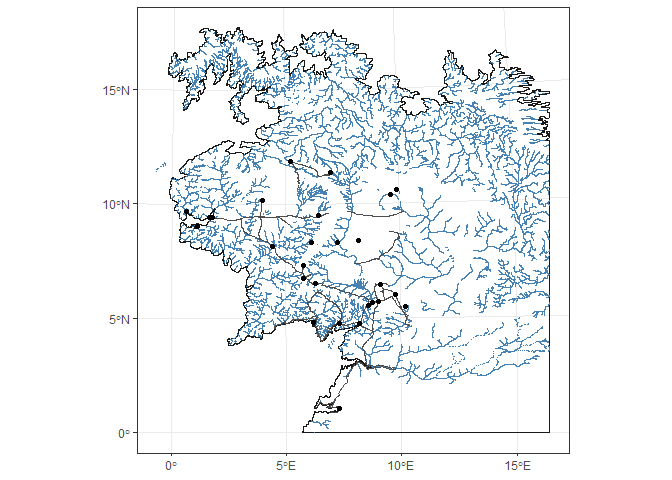
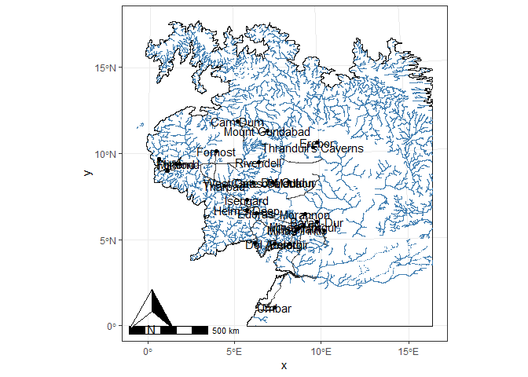
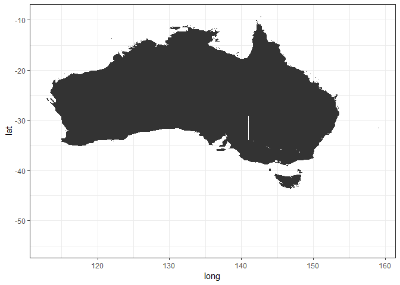
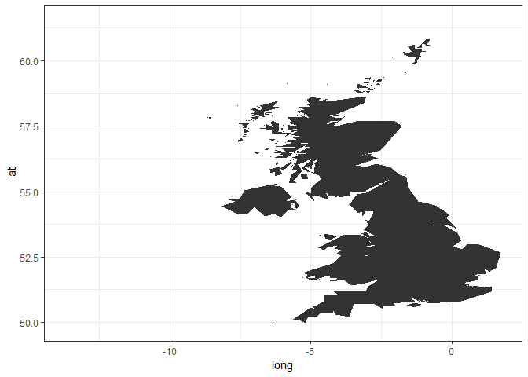

# Setup

```r
library(tidyverse)
library(sf)
library(ggspatial)

theme_set(theme_bw())
```

# Link to github

<https://github.com/brlaw17/Group9-Lab2>

# Middle earth

```r
p <- ggplot() +
  geom_sf(data = read_sf("data/ME-GIS/Coastline2.shp"), 
          colour="grey10", fill="grey90") +
  geom_sf(data = read_sf("data/ME-GIS/Rivers19.shp"), 
          colour="steelblue", size=0.3) +
  geom_sf(data = read_sf("data/ME-GIS/PrimaryRoads.shp"), 
          size = 0.7, colour="grey30") +
  geom_sf(data = read_sf("data/ME-GIS/Cities.shp")) +
  theme_bw()

p
```

<!-- -->

```r
cities = read_sf("data/ME-GIS/Cities.shp")

# p + geom_text(data =  cities, aes(x = ))
p + geom_sf_text(data = cities, aes(label = Name)) + annotation_scale()  +
  annotation_north_arrow(which_north = "true")
```

<!-- -->

# Try out the data, Australia

```r
ozbig <- read_sf("data/gadm36_AUS_shp/gadm36_AUS_1.shp")
oz_st <- maptools::thinnedSpatialPoly(
  as(ozbig, "Spatial"), tolerance = 0.1, 
  minarea = 0.001, topologyPreserve = TRUE)
oz <- st_as_sf(oz_st)

rm(ozbig)
rm(oz_st)

#length(oz$geometry)
#str(oz$geometry[[1]])
#str(oz$geometry[[1]][[1]])
#str(oz$geometry[[10]][[1]])
#oz$geometry[[1]][[2]]
### 

#oz$geometry[[1]][[2]][[1]]

### i, j, k represent the index of the geometry[[i]][[j]][[k]])
### work on k
reorganise_k <- function(x) {
  force(x)
  y <- data.frame(x, group = group, order = 1:nrow(x), i = i, j = j, k = k)
  group <<- group + 1
  k <<- k + 1
  return(y)
}

### work on j
reorganise_j <- function(x) {
  force(x)
  k <<- 1
  y <- lapply(x, FUN = reorganise_k)
  j <<- j + 1
  return(y)
}

### work on i
reorganise_i <- function(x) {
  force(x)
  j <<- 1
  y <- lapply(x, FUN = reorganise_j)
  i <<- i + 1
  return(y)
}

# set initial value
group <- 1
i <- 1
j <- 1
k <- 1

# run
geometry_my1 <- lapply(oz$geometry, reorganise_i)


# oz$geometry[[5]][[243]] is special, 2 list
# lapply(oz$geometry[[5]][[243]], FUN = function(x) dim(x[[1]]))
# str(geometry_my1[[5]][[243]])
# geometry_my1[[5]][[243]][[2]]
# str(geometry_my1[[5]][[243]])
# y <- Reduce(rbind, geometry_my1[[5]][[243]])

# make it a dataframe

reducetodata <- function(x) {
  lapply(x, Reduce, f = rbind)
}

temp1 <- lapply(geometry_my1, reducetodata)
temp2 <- lapply(temp1, Reduce, f = rbind)
geometry_final <- Reduce(rbind, temp2)
rm(temp1, temp2, geometry_my1)

# str(geometry_final)

ozplus <- geometry_final
rm(geometry_final)
names(ozplus) <- c("long", "lat", "group", "order", "i", "j", "k")
```

# Draw the Astralia plot

```r
ozplus %>% ggplot(aes(x = long, y = lat, group = group)) + geom_polygon()
```

<!-- -->

# Make it a function

```r
reoganise <- function(x) {
  ### i, j, k represent the index of the geometry[[i]][[j]][[k]])
  ### work on k
  reorganise_k <- function(x) {
    force(x)
    y <- data.frame(x, group = group, order = 1:nrow(x), i = i, j = j, k = k)
    group <<- group + 1
    k <<- k + 1
    return(y)
  }
  
  ### work on j
  reorganise_j <- function(x) {
    force(x)
    k <<- 1
    y <- lapply(x, FUN = reorganise_k)
    j <<- j + 1
    return(y)
  }
  
  ### work on i
  reorganise_i <- function(x) {
    force(x)
    j <<- 1
    y <- lapply(x, FUN = reorganise_j)
    i <<- i + 1
    return(y)
  }
  
  # set initial value
  group <- 1
  i <- 1
  j <- 1
  k <- 1
  
  # run
  geometry_my1 <- lapply(x, reorganise_i)
  
  reducetodata <- function(x) {
    lapply(x, Reduce, f = rbind)
  }
  
  temp1 <- lapply(geometry_my1, reducetodata)
  temp2 <- lapply(temp1, Reduce, f = rbind)
  ozplus <- Reduce(rbind, temp2)

  names(ozplus) <- c("long", "lat", "group", "order", "i", "j", "k")
  return(ozplus)
}
#ozplus <- reoganise(oz$geometry)
```

# Apply our function to United Kingdom

```r
# read and simiply the shapefile
ozbig2 <- read_sf("data/gadm36_GBR_shp/gadm36_GBR_1.shp")
oz_st2 <- maptools::thinnedSpatialPoly(
  as(ozbig2, "Spatial"), tolerance = 0.1, 
  minarea = 0.001, topologyPreserve = TRUE)
oz2 <- st_as_sf(oz_st2)
rm(ozbig2, oz_st2)
# when we reduce the shapefile, there are warnings for too few points
# take it into consideration, the following map is not surprising

# apply the function to reorganize the data, and draw plot

uk <- reoganise(oz2$geometry)

uk %>% ggplot(aes(x = long, y = lat, group = group)) + 
  geom_polygon()
```

<!-- -->

# How to use "purrr" functionality?? just "map"?
